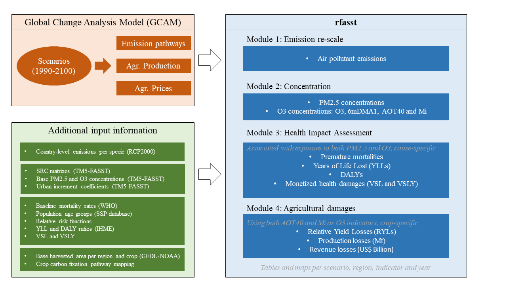

# Summary
`rfasst` does this... Structure of the rfasst package (Figure 1).

`rfasst` can be accessed via the web at the public domain https://github.com/JGCRI/rfasst. We provide an R vignette step-by-step tutorial for users to get started with `rfasst` which is accessible here: [Tutorial](https://jgcri.github.io/rfasst/).

# Statement of need
Existing scientific literature shows that health and agricultural impacts attributable to air pollution are significant and should be considered in the analysis of human and Earth-system interactions. 
In particular, the electrification level, the composition of the vehicle fleet or the investments and deployment of different energy sources would result in different air pollution levels. 
Even though the methodology for estimating the impacts and damages of these changes, such as damage and response functions, are extensively applied by the scientific community, they are normally not included in IA model outputs.

According to the World Health Organization, more than 90% of people breathe unhealthy air at a global level. Therefore, premature mortality associated to air pollution is one of the biggest threats for human health, 
accounting for more than 8 million deaths annually over the world [@burnett2018global], but heavily concentrated in developing Asia.  Likewise, air pollution leads to a significant decrease of crop yields. 
Ozone (O3), which is formed by the reaction of air pollutants with solar radiation, is considered the most hazardous pollutant for crop yields [@emberson2018ozone]. Current high O3 concentration levels entail substantial economic damages 
and would increase pressures on several measures associated with food security. Taking that information into consideration, the integration of these side-effects into an IA model would provide valuable insights for scenario analysis.

Also we know about the Global Change Analysis Model [GCAM; @calvin2019gcam]. The Global Change Analysis Model (GCAM) is developed at the Joint Global Change Research Institute (JGCRI) and is an Integrated Assessment model 
designed to explore both human and Earth-system dynamics. For each scenario, GCAM outputs a full suite of emissions of greenhouse gases and air pollutants, by region and period (through 2100). 
GCAM outputs also include regional agricultural production and yields for a range of crops, detailed in online [documentation](https://github.com/JGCRI/gcam-doc/blob/gh-pages/aglu.md).However, GCAM does not include the atmospheric 
and meteorological information needed for transforming the GHG and air pollutant emissions into particulate matter (PM2.5) and ozone (O3) concentration levels, which are the inputs for the exposure-response functions 
that are normally used for calculating both health and agricultural impacts. This transformation from emissions to concentration is addressed by full chemistry models or by simplified air quality emulators, such as TM5-FASST [@van2018tm5].

We have studied the co-benefits in different studies. @sampedro2020health said this.  And we know this [@markandya2018health].  We have also combined to models to estimate agricultural damages [@sampedro2020future].

The aim of this package is to build a modelling framework that systematically addresses human health and agricultural damages within IA, so they can gradually incorporated to the existing FEWL analysis. 
The packages conects to the outputs of GCAM and replicates the calculations of TM5-FASST in order to estimate the adverse health and agricultural impacts.
It is designed for GCAM but the structure could be adapted to further IAMs.

# Functionality
The package consists of a set of functions that have been classified in four different modules. Note that all the functions are listed and described in the [Tutorial](https://jgcri.github.io/rfasst/reference/index.html).

+ Module 1. Emissions re-scaling: Process emissions by GCAM-region and re-scale them to TM5-FASST regions, and make some additional pollutant-related adjustments. More details in the Module1 emissions page.
+ Module 2. Concentration: Estimate fine particulate matter (PM2.5) and ozone (O3) concentration levels (measured by different indicators) for each region. More details in the Module2 concentration page.
+ Module 3. Health: Report adverse health effects attributable to exposure to fine particulate matter (PM2.5) and ozone (O3; M6M). More details in the Module3 health page.
+ Module 4. Agriculture: Estimate adverse agricultural impacts associated to ozone exposure, including relative yield losses (RYLs) and production and revenue losses. More details in the Module4 agriculture page.

The package also includes default constant values and mapping files mapping files that need to be loaded for the use of the different functions. The `constants.R` file is designed for the user to be able to modify any value for convenience.
The [Tutorial](https://jgcri.github.io/rfasst/) explains which are the values that can be changed within each module. These include the years to include in the analysis (from 2010 to 2100 in 10-year periods +2005), 
the crop categories to be included in the analysis (see @kyle2011gcam for a detailed mapping of GCAM crop categories), the coefficients or counterfactual values for the exposure-response functions (both for health and agricultural damages),
the Values of Statistical Life (VSL) or Values of Statistical Life Year (VSL), or additional ancillary information such as, for example, the shares to allocate emissions between Eastern and Western Russia. 

The outputs of the package include both `.csv` files and maps that are controled by the user. If the parameter `saveOutput`is set to `TRUE`, the function would save a `csv` table with the output in the corresponding sub-directory. 
In addition if `map`is set to `TRUE`, the function generates a set of maps and animations with the corresponding output. We note that these maps are generated using the [rmap](https://github.com/JGCRI/rmap) package, documented in the following [website](jgcri.github.io/rmap/).

Finally, the package is expected to be in continous development and some additional features are planned to be implemented. In the near-term, we will apply a dynamic GDP-based downscalling technique in Module 1. 
In addition, we are planning to add additional age-specific health functions. For the longer-term, one of the potential developments would be to make structure more flexible, so the tool can be used by other Integrated Assessment Models.

# Acknowledgements
This research was supported by ... The views and opinions expressed in this paper are those of the authors alone.

# References
