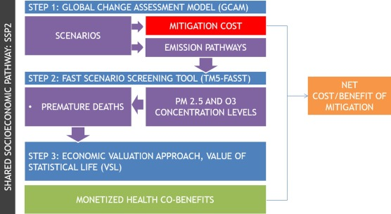

# Statement of need
This is my statement of need @sampedro2020health said this.  And we know this [@markandya2018health].  Also we know about the Global Change Analysis Model [GCAM; @calvin2019gcam].  This is a figure I took from one of your papers (Figure 1).

# Summary
`rfasst` does this...

`rfasst` can be accessed via the web at the public domain https://github.com/JGCRI/rfasst. We provide an R vignette step-by-step tutorial for users to get started with `rfasst` which is accessible here: [Tutorial](https://jgcri.github.io/rfasst/).

# Functionality
The package consists of a set of functions divided in four different modules:

Module 1. Emissions re-scaling: Process emissions by GCAM-region and re-scale them to TM5-FASST regions, and make some additional pollutant-related adjustments. More details in the Module1 emissions page.
Module 2. Concentration: Estimate fine particulate matter (PM2.5) and ozone (O3) concentration levels (measured by different indicators) for each region. More details in the Module2 concentration page.
Module 3. Health: Report adverse health effects attributable to exposure to fine particulate matter (PM2.5) and ozone (O3; M6M). More details in the Module3 health page.
Module 4. Agriculture: Estimate adverse agricultural impacts associated to ozone exposure, including relative yield losses (RYLs) and production and revenue losses. More details in the Module4 agriculture page.
In addition, the package includes some default mapping files and default values, that are read by the different functions. These can be easily changed by the user in the /R/constants.R file. Some of these constants include:

Years to be analyzed: In the all_years vector, the user can select the years to be included in the analysis. All the avialble years are '2005','2010','2020','2030','2040','2050','2060','2070','2080','2090','2100'.It is no possible to add any other year, but they can be reduced if desired (for example to reduce computation time).
GCAM crop categories to be included in the analysis
Shares to allocate emissions between Russia Eastern (RUE) and Russia Western (RUS)
Coefficients and/or counterfactual values for exposure-response functions applied to estimate adverse health and agricultural impacts.
Median values for the health impact economic assessment (Value of Statistical Life)
Other

# Acknowledgements
This research was supported by ... The views and opinions expressed in this paper are those of the authors alone.

# References
