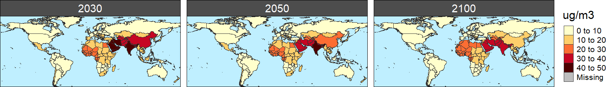

# Summary
Existing scientific literature shows that health and agricultural impacts attributable to air pollution are significant and should be considered in the integrated analysis of human and Earth-system interactions.
The implementation of policies that affect to the electrification level, the composition of the vehicle fleet or the investments and deployment of different energy sources would result in different air pollution levels. 
Even though the methodology for estimating the impacts of air pollution, such as exposure-response functions, are extensively applied by the scientific community, 
they are normally not included in integrated assessment modeling outputs.

`rfasst` is an R package designed to estimate future human-health and agricultural damages attributable to air pollution within the Global Change Analysis Model (GCAM).
The package reads in outputs of a GCAM scenario, namely emission pathways and agricultural production and prices, and replicates the calculations of the TM5-FASST air quality model 
in order to estimate the associated adverse health and agricultural impacts. The structure of the `rfasst` package is summarized in the following Figure 1.

`rfasst` can be accessed via the web at the public domain https://github.com/JGCRI/rfasst. We provide an R vignette step-by-step tutorial for users to get started with `rfasst` which is accessible here: [Tutorial](https://jgcri.github.io/rfasst/).

# Statement of need

According to the World Health Organization (WHO), more than 90% of people breathe unhealthy air at a global level. Therefore, premature mortality associated to air pollution is one of the biggest threats for human health, 
accounting for more than 8 million deaths annually over the world [@burnett2018global], but heavily concentrated in developing Asia.  Likewise, air pollution leads to a significant decrease of crop yields. 
Ozone, which is formed by the reaction of air pollutants with solar radiation, is considered the most hazardous pollutant for crop yields [@emberson2018ozone]. 
Current high ozone concentration levels entail substantial economic damages and would increase pressures on several measures associated with food security. 
The integration of these effects into integrated assessment models, such as GCAM, would provide valuable insights for scenario analysis.

The GCAM model [@calvin2019gcam], developed at the Joint Global Change Research Institute (JGCRI), is an integrated assessment multi-sector model designed to explore human and Earth-system dynamics. 
For each scenario, GCAM reports a full suite of emissions of greenhouse gases and air pollutants, by region and period (through 2100). 
GCAM outputs also include regional agricultural production projections for a range of crops, detailed in online [documentation](https://github.com/JGCRI/gcam-doc/blob/gh-pages/aglu.md). However, GCAM does not include the atmospheric 
and meteorological information required to translate the GHG and air pollutant emissions into particulate matter ($PM_{2.5}$) and ozone ($O_{3}$) concentration levels. 
This transformation from emissions to concentration is addressed by full chemistry models or by simplified air quality emulators, such as TM5-FASST [@van2018tm5].
These concentration levels are the inputs for the exposure-response functions that are normally used to calculate adverse human-health and agricultural effects associated with exposure to $PM_{2.5}$ and $O_{3}$.  

Therefore, the combined use of these models, which is the essence of `rfasst`, is a powerful methodology to estimate a consistent range of health and agricultural damages and the co-benefits associated with different strategies or climate policies.
Prior to the development of this package, we have used GCAM and TM5-FASST to analyze these co-benefits in different studies. @sampedro2020health shows that health co-benefits attributable to air pollution are larger than mitigation costs 
for different technological scenarios consistent with the 2°C target of the Paris Agreement.  
Previously, in [@markandya2018health], we demonstrated that these health co-benefits outweigh mitigation costs in multiple decarbonization scenarios based on different emissions abatement efforts across regions.  
In addition, we have applied this methodology to show how high $O_{3}$ levels generate substantial crop losses and, subsequently, negative economic impacts in the agricultural sector [@sampedro2020future].
Taking all these results into consideration, we understand that a tool that systematically addresses air pollution driven human-health and agricultural damages within an integrated assessment modelling framework, 
is a significant contribution to this community, and it would be of interest for a range of stakeholders, particularly for the design of alternative transition strategies. 

# Functionality
The package includes several functions that have been classified in four different modules. 
Note that all the functions are listed in the [Tutorial](https://jgcri.github.io/rfasst/), which includes individual documentation pages for each of these modules.

+ Module 1: Static downscaling of GCAM emissions to country-level and re-aggregation into a new regional distribution (consistent with TM5-FASST), and some additional pollutant-related adjustments (e.g. organic carbon to organic matter).
+ Module 2: Calculation of regional fine particulate matter ($PM_{2.5}$) and ozone ($O_{3}$) concentration levels using different indicators, described in the corresponding documentation [vignette](https://jgcri.github.io/rfasst/articles/Module2_concentration.html).
+ Module 3: Estimation of health impacts attributable to $PM_{2.5}$ and $O_{3}$ exposure. The package reports both physical damages, such as premature mortality, years of life lost (YLLs), and disability adjusted life years (DALYs),
and the associated monetized damages based on the Value of Statistical Life (VSL).
+ Module 4: Estimation of agricultural damages attributable to $O_{3}$ exposure, including relative yield losses (RYLs), and losses in agricultural production and revenue ($Revenue=Prod \cdot Price$).

The package also includes additional input information, namely constant values and mapping files, that need to be read in for running the different functions. The `constants.R` file is flexible and easy to be modified by the user.
The [Tutorial](https://jgcri.github.io/rfasst/) explains which are the values that can be changed within each module. These include the time horizon (from 2010 to 2100 in 10-year periods, +2005), 
the crop categories to be included in the analysis (see @kyle2011gcam for a detailed mapping of GCAM crop categories), the coefficients or counterfactual values for the exposure-response functions (both for health and agricultural damages),
the base Value of Statistical Life (VSL) or Value of Statistical Life Year (VSLY), and additional ancillary information.

The outputs generated by the package consist of both `.csv` files and maps that can be controlled by the user. If the parameter `saveOutput` is set to `TRUE`, the function writes a `csv` table with the selected outcome in the corresponding sub-directory. 
In addition, if `map` is set to `TRUE`, the function generates a suite of maps and animations for the corresponding output. We note that these maps are generated using the [rmap](https://github.com/JGCRI/rmap) package, documented in the following [website](jgcri.github.io/rmap/).
As an example, the following Figure 2 shows the average $PM_{2.5}$ concentration levels per region, for a GCAM-v5.3 reference scenario.

Finally, the package is expected to be in continuous development and some additional features are planned to be implemented in the near and the longer terms. For example, an alternative dynamic GDP-based downscaling technique
for re-scaling GCAM emissions in Module 1, additional age-specific functions for the health impact assessment, or a more flexible structure, so the package would be able to read in emission pathways from different models. 

# Acknowledgements
The research described in this paper was conducted under the Laboratory Directed Research and Development Program at Pacific Northwest National Laboratory, a multiprogram national laboratory operated by Battelle for the U.S. Department of Energy. 
The views and opinions expressed in this paper are those of the authors alone.

# References
